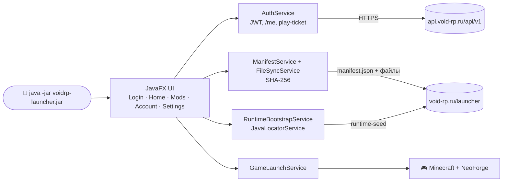
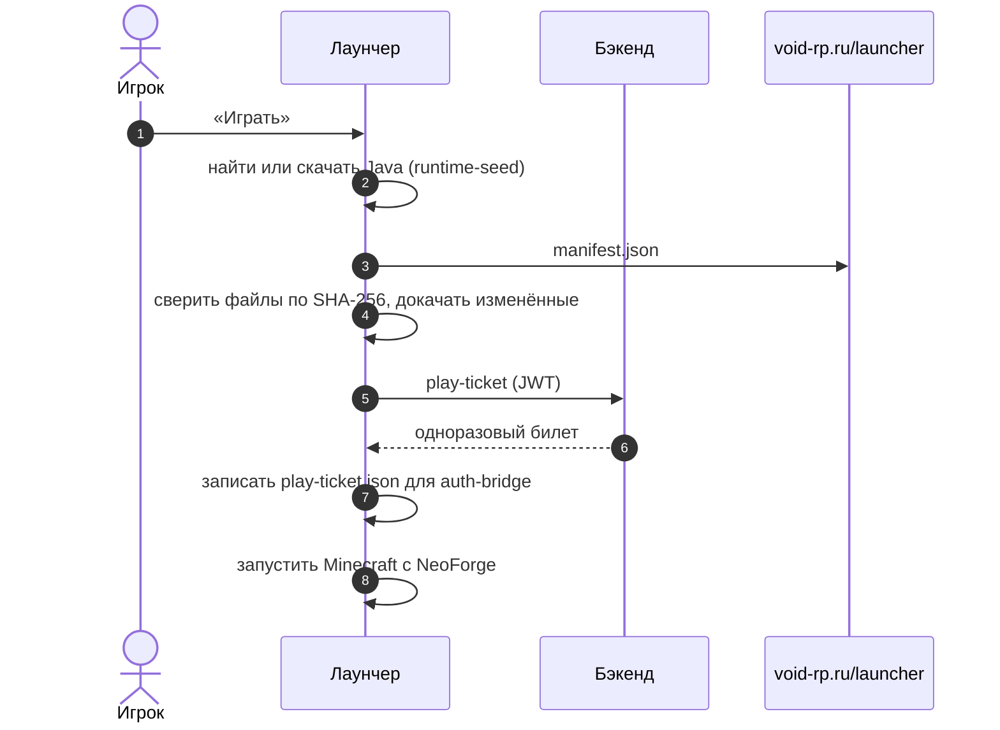

# ☕ VoidRP Launcher (Java)

> Автономный Java-лаунчер VoidRP — единый fat JAR без внешних зависимостей.


[](https://github.com/VOIDRP-MINECRAFT/voidrp-launcher-java/actions/workflows/build.yml)


---

## 🗺️ Место в экосистеме



Альтернатива [voidrp-launcher-vue](https://github.com/VOIDRP-MINECRAFT/voidrp-launcher-vue) для случаев, когда Electron недоступен или нежелателен.

---

## ✨ Возможности

- **Единый fat JAR** (~56 MB) — не требует установки, достаточно Java 21
- **Авторизация** через аккаунт VoidRP (play-ticket flow)
- **Автообновление модпака** — скачивает, проверяет SHA-256 контрольные суммы
- **Bootstrap JVM** — запускает Minecraft с нужными параметрами
- **JavaFX UI** — нативный интерфейс без браузера
- **Верификация манифеста** — каждый файл модпака проверяется по хешу перед запуском

---

## 🔄 Что происходит по кнопке «Играть»



---

## 📋 Требования

| Компонент | Версия |
|---|---|
| Java | 21+ |
| Интернет | доступ к `https://void-rp.ru` |

---

## 🚀 Сборка и запуск

```bash
cd voidrp_launcher_java

# Сборка fat JAR
./gradlew shadowJar
# → build/libs/voidrp-launcher-*.jar  (~56 MB)

# Запуск
java -jar build/libs/voidrp-launcher-*.jar
```

---

## 🏗️ Структура

```
src/main/java/ru/voidrp/launcher/
├── Main.java · App.java     точка входа и JavaFX Application
├── config/                   AppConfig, LauncherPaths — адреса и папки
├── model/ · model/api/       DTO бэкенда (токены, /me, play-ticket, скины, дашборд), манифест, настройки
├── service/                  Auth · Manifest · FileSync · Hash · RuntimeBootstrap · JavaLocator · GameLaunch · Mod · Settings · TokenStore · ApiClient
└── ui/ · ui/views/           MainWindow, экраны Login, Home, Mods, Account, Settings, окно ошибок
```

JavaFX 21 упакован в fat JAR для Windows, Linux и macOS (Intel и Apple Silicon).

---

## 🔗 Связанные репозитории

| Репо | Связь |
|---|---|
| [minecraft-backend](https://github.com/VOIDRP-MINECRAFT/minecraft-backend) | Auth API, play-ticket endpoint |
| [voidrp-launcher-vue](https://github.com/VOIDRP-MINECRAFT/voidrp-launcher-vue) | Основной лаунчер (Electron + .NET) |

---

<div align="center">
<a href="https://void-rp.ru">🌐 Сайт</a> ·
<a href="https://github.com/VOIDRP-MINECRAFT">🏠 Организация</a>
</div>
